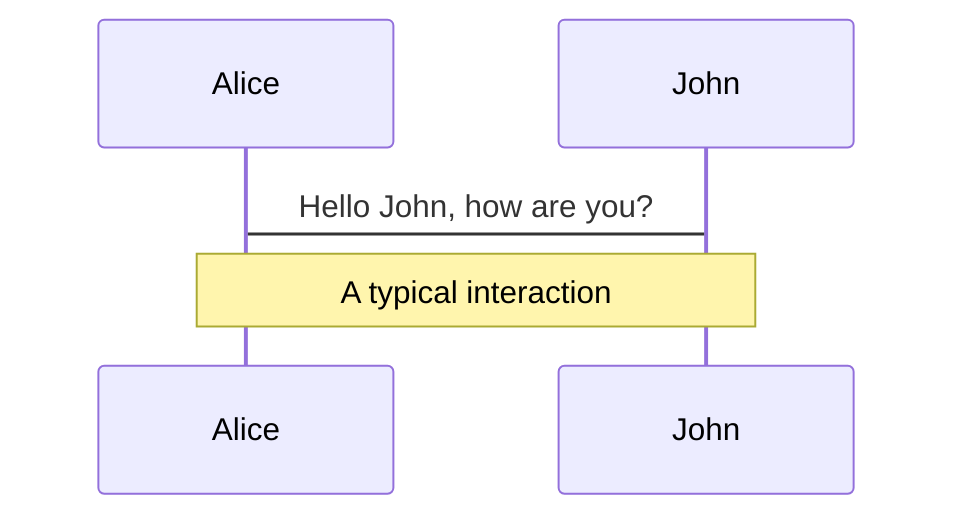
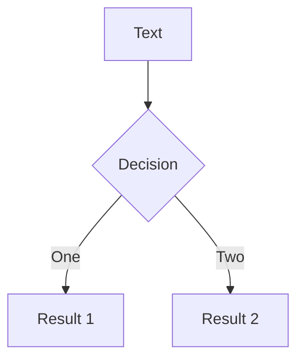
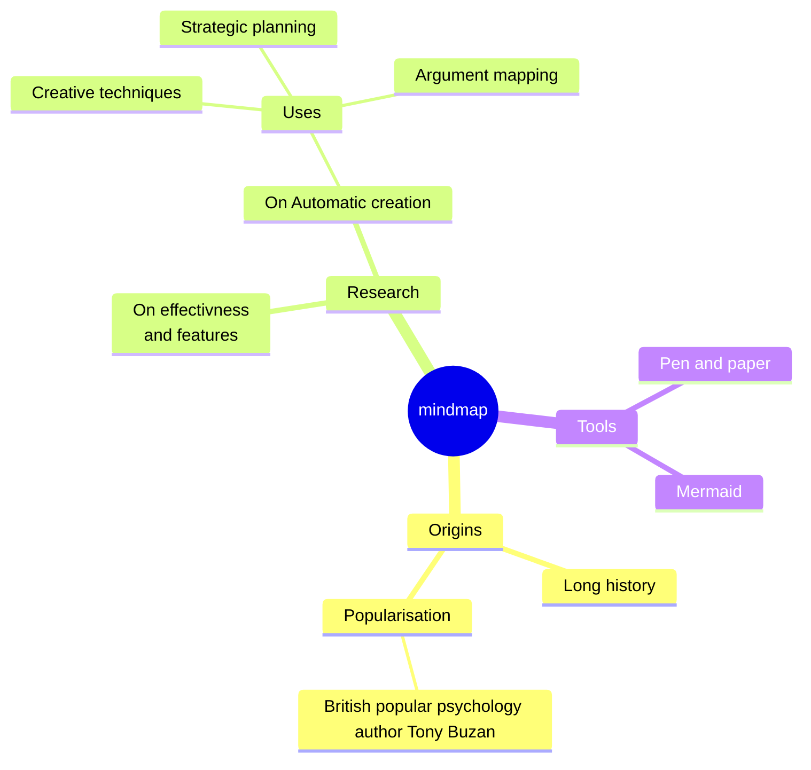
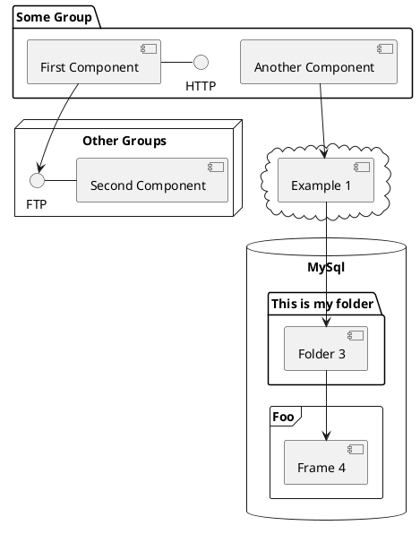

# Angular Performance Optimizations

How to elevate the performance of an Angular App to the next level.

<div class="mt-10 h-16 flex flex-row gap-5">
  
</div>

<MySocialLinks />

<!--
The last comment block of each slide will be treated as slide notes. It will be visible and editable in Presenter Mode along with the slide. [Read more in the docs](https://sli.dev/guide/syntax.html#notes)
-->

---

# Measurements

- Lines of Code / file count
- Build duration
- Initial bundle size
- Lighthouse performance score
  - First Contentful Paint
  - Largest Contentful Paint
  - Total Blocking Time
  - Cumulative Layout Shift
  - Speed Index

<!--
- First Contentful Paint: Time to first text or image is painted on Screen
- Largest Contentful Paint: Time to the largest text or image is painted
- Total Blocking Time: Total amount of time after First Contentful Paint where the main thread is blocked for long enough (>50ms) to prevent input responsiveness
- Cumulative Layout Shift: Movement of visible page content
- Speed Index: How quickly content is visually displayed during page load
-->

---

# Optimization steps

- App structure
- Standalone components
- Lazy loading
- Image loading
- esbuild
- Server-side rendering 

---

# App structure

- Choose base components wisely (MatToolbar, MatCard, MatSidenav)
- Do not use TailwindCSS `@apply` in CSS files
- Use CSS instead of JavaScript

---

# Standalone components [^1]

- Available since Angular 15

<div class="flex flex-row justify-around">

```ts
@Component({
  selector: 'app-login',
  templateUrl: './login.component.html',
})
export class LoginComponent {}

@NgModule({
  declarations: [LoginComponent],
  imports: [CommonModule, MatButtonModule],
  exports: [LoginComponent]
})
export class LoginModule {}
```

```ts
@Component({
  selector: 'app-login',
  templateUrl: './login.component.html',
  standalone: true,
  imports: [NgIf, MatButtonModule],
})
export class LoginComponent {}
```

</div>

[^1]: https://github.com/sonallux/angular-music/pull/106

<!--
- Some new Angular Feature require standalone components
-->

---

# Standalone components [^1]

| Stats               | Relative change |
|---------------------|-----------------|
| Build time          | 0%              |
| Lines of Code       | - 2%            |
| Initial bundle size | - 2%            |

[^1]: https://github.com/sonallux/angular-music/pull/106

---

# Lazy loading [^1]

- Lazy load routes
- Lazy load animations `provideAnimationsAsync()` (>= Angular 17)
- Defer component loading with `@defer` (only works for standalone components) (>= Angular 17)

<div class="mt-4" v-click>

| Stats               | Relative change |
|---------------------|-----------------|
| Build time          | - 4%            |
| Lines of Code       | 0%              |
| Initial bundle size | - 33%           |

</div>

[^1]: https://github.com/sonallux/angular-music/pull/107

---

# Image loading [^1]

- Use `NgOptimizedImage` directive (>= Angular 15)
- Adjust image size to render size
- Add `preconnect` instructions

<div class="mt-4" v-click>

| Stats               | Relative change |
|---------------------|-----------------|
| Build time          | + 2%            |
| Lines of Code       | + 2%            |
| Initial bundle size | + 1%            |

</div>

[^1]: https://github.com/sonallux/angular-music/pull/108

---

# esbuild [^1]

- Switch from webpack to esbuild
- Use `browser-esbuild` as drop-in replacement or `application` builder (>= Angular 17)

<div class="mt-4" v-click>

| Stats               | Relative change |
|---------------------|-----------------|
| Build time          | - 49%           |
| Lines of Code       | 0%              |
| Initial bundle size | + 8%            |

</div>

<!--
- webpack (javascript)
- esbuild (Go)
-->

[^1]: https://github.com/sonallux/angular-music/pull/109

---

# Server-side rendering (SSR) [^1]

<div v-click>

- For static content prerender HTML during build time (static site generation (SSG))
- For dynamic content render HTML on server (server-side rendering (SSR))

</div>

<!--
- < Angular 17: nguniversal
- >= Angular 17: built into Angular CLI using Application builder
-->

[^1]: https://github.com/sonallux/angular-music/pull/110

---

# Lighthouse Score

| Page     | Baseline | Standalone | Lazy loading | Image loading | esbuild | SSR   |
|----------|----------|------------|--------------|---------------|---------|-------|
| Home     | 81       | 82         | 83           | 85            | 85      | 88    |
| Browse   | 73       | 71         | 78           | 75            | 75      | 77    |
| Category | 87       | 82         | 88           | 86            | 88      | 75    |
| Playlist | 91       | 93         | 93           | 93            | 92      | 97    |
| Album    | 92       | 92         | 93           | 93            | 93      | 99    |
| Artist   | 91       | 89         | 91           | 91            | 92      | 98    |
|          |          |            |              |               |         |       |
| Average  | 85,83    | 84,83      | 87,67        | 87,17         | 87,50   | 89,00 |

<!--
- Desktop mode vs mobile mode
- More throttling on mobile mode
- Mobile mode: nearly no improvement in Lighthouse score
- Category SSR Score: Playlist grid column count is calculated via JS and fixed to 3 cols with SSR &rarr; big cumulative layout shift
-->

---

# Next steps

- OnPush Change detection
- New control flow syntax with `@if()`, `@for()`, `@switch()`
- Angular signals
- Zoneless change detection

---

# Fragen ?

<ul class="mt-10">
  <li><a href="https://github.com/sonallux/angular-music"><mdi-github /> Angular Music App</a></li>
  <li><a href="https://web.dev/articles/vitals?hl=de#core-web-vitals"><mdi-file-document />Core Web Vitals</a></li>
  <li><a href="https://angular.dev/guide/defer"><mdi-angular /> Deferrable Views</a></li>
  <li><a href="https://angular.dev/guide/image-optimization"><mdi-angular /> NgOptimizedImage</a></li>
  <li><a href="https://angular.dev/guide/ssr"><mdi-angular /> Server-side rendering</a></li>
  <li><a href="https://angular.dev/guide/hydration"><mdi-angular /> Hydration</a></li>
  <li><a href="https://angular.dev/guide/prerendering"><mdi-angular /> Prerendering (SSG)</a></li>
  <li><a href="https://github.com/tastejs/angular-movies"><mdi-github /> Angular Movies App</a></li>
</ul>

<MySocialLinks />

---
# What is Slidev?

Slidev is a slides maker and presenter designed for developers, consist of the following features

- 📝 **Text-based** - focus on the content with Markdown, and then style them later
- 🎨 **Themable** - theme can be shared and used with npm packages
- 🧑‍💻 **Developer Friendly** - code highlighting, live coding with autocompletion
- 🤹 **Interactive** - embedding Vue components to enhance your expressions
- 🎥 **Recording** - built-in recording and camera view
- 📤 **Portable** - export into PDF, PNGs, or even a hostable SPA
- 🛠 **Hackable** - anything possible on a webpage

<br>
<br>

Read more about [Why Slidev?](https://sli.dev/guide/why)

<!--
Here is another comment.
-->

---
layout: default
---

# Table of contents

```html
<Toc minDepth="1" maxDepth="1"></Toc>
```

<Toc maxDepth="1"></Toc>

---
transition: slide-up
level: 2
---

# Navigation

Hover on the bottom-left corner to see the navigation's controls panel, [learn more](https://sli.dev/guide/navigation.html)

## Keyboard Shortcuts

|     |     |
| --- | --- |
| <kbd>right</kbd> / <kbd>space</kbd>| next animation or slide |
| <kbd>left</kbd>  / <kbd>shift</kbd><kbd>space</kbd> | previous animation or slide |
| <kbd>up</kbd> | previous slide |
| <kbd>down</kbd> | next slide |

<!-- https://sli.dev/guide/animations.html#click-animations -->

<p v-after class="absolute bottom-23 left-45 opacity-30 transform -rotate-10">Here!</p>

---
layout: image-right
image: https://source.unsplash.com/collection/94734566/1920x1080
---

# Code

Use code snippets and get the highlighting directly, and even types hover![^1]

```ts {all|5|1-6|9|all} twoslash
// TwoSlash enables TypeScript hover information and errors in markdown code blocks
// Learn more at https://www.typescriptlang.org/dev/twoslash/
function getUser(id: number): User {
  return undefined as any
}
function saveUser(id: number, user: User) {
  // ...
}
// ---cut---
interface User {
  id: number
  firstName: string
  lastName: string
  role: string
// ^?
}

function updateUser(id: number, update: User) {
  const user = getUser(id)
  const newUser = { ...user, ...update }
  saveUser(id, newUser)
}
```

<arrow v-click="[3, 4]" x1="400" y1="420" x2="230" y2="330" color="#564" width="3" arrowSize="1" />

[^1]: [Learn More](https://sli.dev/guide/syntax.html#line-highlighting)

<style>
.footnotes-sep {
  @apply mt-20 opacity-10;
}
.footnotes {
  @apply text-sm opacity-75;
}
.footnote-backref {
  display: none;
}
</style>

---

# Components

<div grid="~ cols-2 gap-4">
<div>

You can use Vue components directly inside your slides.

We have provided a few built-in components like `<Tweet/>` and `<Youtube/>` that you can use directly. And adding your custom components is also super easy.

```html
<Counter :count="10" />
```

<!-- ./components/Counter.vue -->
<Counter :count="10" m="t-4" />

Check out [the guides](https://sli.dev/builtin/components.html) for more.

</div>
<div>

```html
<Tweet id="1390115482657726468" />
```

<Tweet id="1390115482657726468" scale="0.65" />

</div>
</div>

<!--
Presenter note with **bold**, *italic*, and ~~striked~~ text.

Also, HTML elements are valid:
<div class="flex w-full">
  <span style="flex-grow: 1;">Left content</span>
  <span>Right content</span>
</div>
-->

---
class: px-20
---

# Themes

Slidev comes with powerful theming support. Themes can provide styles, layouts, components, or even configurations for tools. Switching between themes by just **one edit** in your frontmatter:

<div grid="~ cols-2 gap-2" m="t-2">

```yaml
---
theme: default
---
```

```yaml
---
theme: seriph
---
```


</div>

Read more about [How to use a theme](https://sli.dev/themes/use.html) and
check out the [Awesome Themes Gallery](https://sli.dev/themes/gallery.html).

---
preload: false
---

# Animations

Animations are powered by [@vueuse/motion](https://motion.vueuse.org/).

```html
<div
  v-motion
  :initial="{ x: -80 }"
  :enter="{ x: 0 }">
  Slidev
</div>
```

<div class="w-60 relative mt-6">
  <div class="relative w-40 h-40">
    
    
    
  </div>

  <div
    class="text-5xl absolute top-14 left-40 text-[#2B90B6] -z-1"
    v-motion
    :initial="{ x: -80, opacity: 0}"
    :enter="{ x: 0, opacity: 1, transition: { delay: 2000, duration: 1000 } }">
    Slidev
  </div>
</div>

<!-- vue script setup scripts can be directly used in markdown, and will only affects current page -->
<script setup lang="ts">
const final = {
  x: 0,
  y: 0,
  rotate: 0,
  scale: 1,
  transition: {
    type: 'spring',
    damping: 10,
    stiffness: 20,
    mass: 2
  }
}
</script>

<div
  v-motion
  :initial="{ x:35, y: 40, opacity: 0}"
  :enter="{ y: 0, opacity: 1, transition: { delay: 3500 } }">

[Learn More](https://sli.dev/guide/animations.html#motion)

</div>

---

# LaTeX

LaTeX is supported out-of-box powered by [KaTeX](https://katex.org/).

<br>

Inline $\sqrt{3x-1}+(1+x)^2$

Block
$$ {1|3|all}
\begin{array}{c}

\nabla \times \vec{\mathbf{B}} -\, \frac1c\, \frac{\partial\vec{\mathbf{E}}}{\partial t} &
= \frac{4\pi}{c}\vec{\mathbf{j}}    \nabla \cdot \vec{\mathbf{E}} & = 4 \pi \rho \\

\nabla \times \vec{\mathbf{E}}\, +\, \frac1c\, \frac{\partial\vec{\mathbf{B}}}{\partial t} & = \vec{\mathbf{0}} \\

\nabla \cdot \vec{\mathbf{B}} & = 0

\end{array}
$$

<br>

[Learn more](https://sli.dev/guide/syntax#latex)

---

# Diagrams

You can create diagrams / graphs from textual descriptions, directly in your Markdown.

<div class="grid grid-cols-4 gap-5 pt-4 -mb-6">









</div>

[Learn More](https://sli.dev/guide/syntax.html#diagrams)

---
layout: center
class: text-center
---

# Learn More

[Documentations](https://sli.dev) · [GitHub](https://github.com/slidevjs/slidev) · [Showcases](https://sli.dev/showcases.html)
