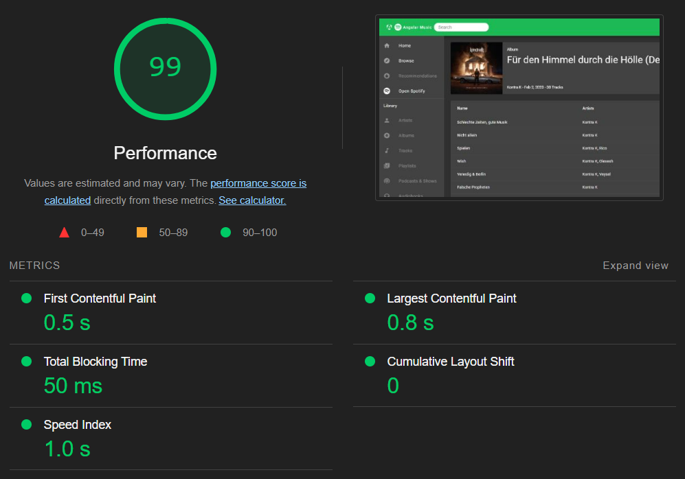
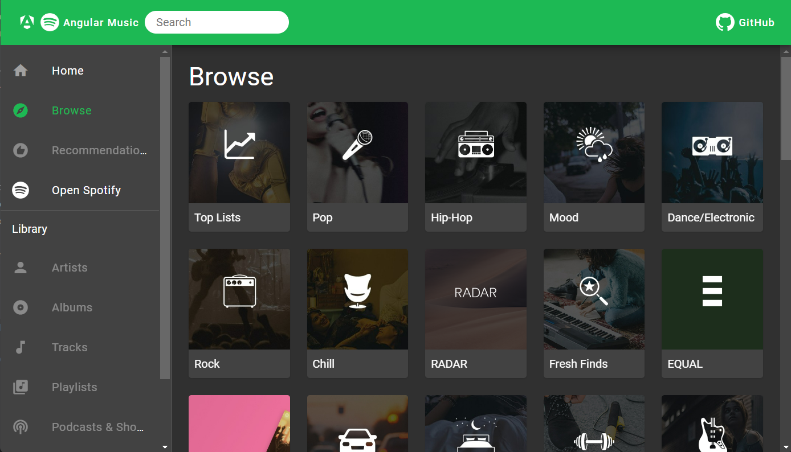
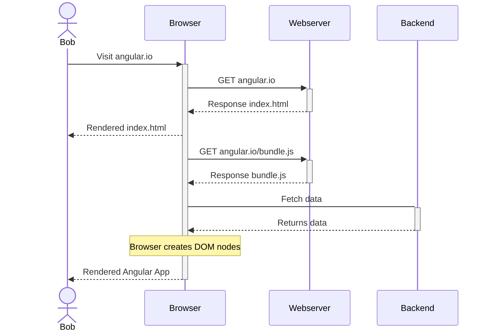
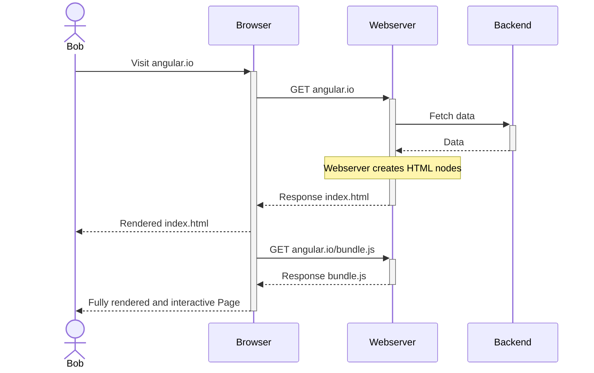
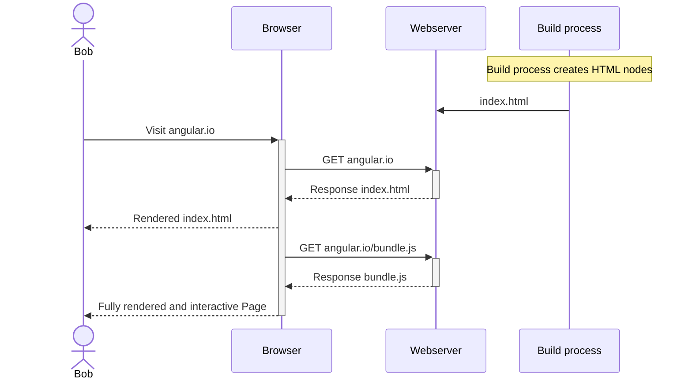

# Angular Performance Optimizations

---
layout: center
---

<div class="px-16">
  
</div>

<!-- 
Lighthouse: Performance, Accessibility, SEO
-->

---
layout: cover
---

# Angular Performance Optimizations

How to elevate the performance of an Angular App to the next level 🚀

<div class="mt-10 h-16 flex flex-row gap-5">
  
</div>

<MySocialLinks />

<!--
The last comment block of each slide will be treated as slide notes. It will be visible and editable in Presenter Mode along with the slide. [Read more in the docs](https://sli.dev/guide/syntax.html#notes)
-->

---

# Content

- Application
- Measurements
- Optimization steps
  - General
  - Standalone components
  - Lazy loading
  - Image loading
  - esbuild
  - Server-side rendering
- Results

---

# Angular Music

<div class="px-16">
  
</div>

---

# Measurements

- Lines of code
- Build duration
- Initial bundle size
- Lighthouse performance score
  - First Contentful Paint
  - Largest Contentful Paint
  - Total Blocking Time
  - Cumulative Layout Shift
  - Speed Index

<!--
- First Contentful Paint: Time to first text or image is painted on Screen
- Largest Contentful Paint: Time to the largest text or image is painted
- Total Blocking Time: Total amount of time after First Contentful Paint where the main thread is blocked for long enough (>50ms) to prevent input responsiveness
- Cumulative Layout Shift: Movement of visible page content
- Speed Index: How quickly content is visually displayed during page load
-->

---

# General

- Choose base components wisely (MatToolbar, MatCard, MatSidenav)
- Do not use TailwindCSS `@apply` in CSS files
- Use CSS instead of JavaScript
- Reduce Backend request count and payload
- Cache JavaScript and CSS bundles

<!-- 
Prefer CSS media queries instead of using BreakpointObserver
-->

---

# Standalone components [^1]

- Available since Angular 15

<div class="flex flex-row justify-around">

```ts
@Component({
  selector: 'app-login',
  templateUrl: './login.component.html',
})
export class LoginComponent {}

@NgModule({
  declarations: [LoginComponent],
  imports: [CommonModule, MatButtonModule],
  exports: [LoginComponent]
})
export class LoginModule {}
```

```ts
@Component({
  selector: 'app-login',
  templateUrl: './login.component.html',
  standalone: true,
  imports: [NgIf, MatButtonModule],
})
export class LoginComponent {}
```

</div>

[^1]: https://github.com/sonallux/angular-music/pull/106

<!--
- Some new Angular Feature require standalone components
-->

---

# Standalone components [^1]

| Stats               | Relative change |
|---------------------|-----------------|
| Build time          | 0%              |
| Lines of code       | - 2%            |
| Initial bundle size | - 2%            |

[^1]: https://github.com/sonallux/angular-music/pull/106

---

# Lazy loading [^1]

- Lazy load routes
- Lazy load animations `provideAnimationsAsync()` (>= Angular 17)
- Defer component loading with `@defer` (only works for standalone components) (>= Angular 17)

<div class="mt-4" v-click>

| Stats               | Relative change |
|---------------------|-----------------|
| Build time          | - 4%            |
| Lines of Code       | 0%              |
| Initial bundle size | - 33%           |

</div>

[^1]: https://github.com/sonallux/angular-music/pull/107

---

# Image loading [^1]

- Use `NgOptimizedImage` directive (>= Angular 15)
- Adjust image size to render size
- Add `preconnect` instructions

<div class="mt-4" v-click>

| Stats               | Relative change |
|---------------------|-----------------|
| Build time          | + 2%            |
| Lines of Code       | + 2%            |
| Initial bundle size | + 1%            |

</div>

[^1]: https://github.com/sonallux/angular-music/pull/108

---

# esbuild [^1]

- Switch from webpack to esbuild
- Use `browser-esbuild` as drop-in replacement or `application` builder (>= Angular 17)

<div class="mt-4" v-click>

| Stats               | Relative change |
|---------------------|-----------------|
| Build time          | - 49%           |
| Lines of Code       | 0%              |
| Initial bundle size | + 8%            |

</div>

<!--
- webpack (javascript)
- esbuild (Go)
-->

[^1]: https://github.com/sonallux/angular-music/pull/109

---

# Server-side rendering (SSR) [^1]

<!--
- < Angular 17: nguniversal
- >= Angular 17: built into Angular CLI using Application builder
-->

[^1]: https://github.com/sonallux/angular-music/pull/110

---

# Client-side rendering



<!--
Templates are rendered on the Browser
-->

---

# Server-side rendering (SSR)



<!--
Templates are rendered on the Server
-->

---

# Static Side generation (SSG)



<!--
Templates are rendered during the build process of the App
-->

---

# Server-side rendering (SSR) [^1]

| Stats               | Relative change |
|---------------------|-----------------|
| Build time          | + 50%           |
| Lines of Code       | + 3%            |
| Initial bundle size | + 2%            |

[^1]: https://github.com/sonallux/angular-music/pull/110

---

# Lighthouse Score

| Page     | Baseline | Standalone | Lazy loading | Image loading | esbuild | SSR   |
|----------|----------|------------|--------------|---------------|---------|-------|
| Home     | 81       | 76         | 79           | 84            | 84      | 87    |
| Browse   | 73       | 74         | 81           | 78            | 85      | 75    |
| Category | 87       | 87         | 88           | 88            | 88      | 74    |
| Playlist | 91       | 92         | 93           | 93            | 93      | 96    |
| Album    | 92       | 91         | 93           | 93            | 93      | 98    |
| Artist   | 91       | 91         | 91           | 92            | 91      | 98    |
|          |          |            |              |               |         |       |
| Average  | 85,83    | 85,17      | 87,50        | 88,00         | 89,00   | 88,00 |

<!--
- Desktop mode vs mobile mode
- More throttling on mobile mode
- Mobile mode: nearly no improvement in Lighthouse score
- Category SSR Score: Playlist grid column count is calculated via JS and fixed to 3 cols with SSR &rarr; big cumulative layout shift
-->

---

# Next steps

- OnPush change detection
- New control flow syntax with `@if()`, `@for()`, `@switch()`
- Angular signals
- Zoneless change detection

---

# Fragen ?

<ul class="mt-10">
  <li><a href="https://github.com/sonallux/angular-music"><mdi-github /> Angular Music App</a></li>
  <li><a href="https://web.dev/articles/vitals?hl=de#core-web-vitals"><mdi-file-document />Core Web Vitals</a></li>
  <li><a href="https://angular.dev/guide/defer"><mdi-angular /> Deferrable Views</a></li>
  <li><a href="https://angular.dev/guide/image-optimization"><mdi-angular /> NgOptimizedImage</a></li>
  <li><a href="https://angular.dev/guide/ssr"><mdi-angular /> Server-side rendering</a></li>
  <li><a href="https://angular.dev/guide/hydration"><mdi-angular /> Hydration</a></li>
  <li><a href="https://angular.dev/guide/prerendering"><mdi-angular /> Prerendering (SSG)</a></li>
  <li><a href="https://github.com/tastejs/angular-movies"><mdi-github /> Angular Movies App</a></li>
</ul>

<MySocialLinks />
