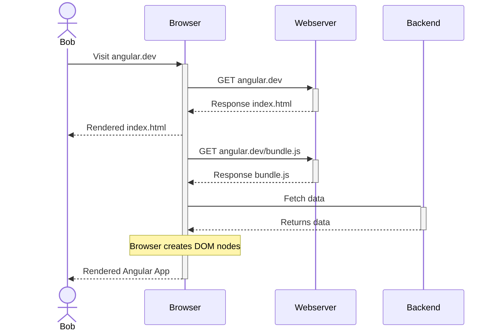
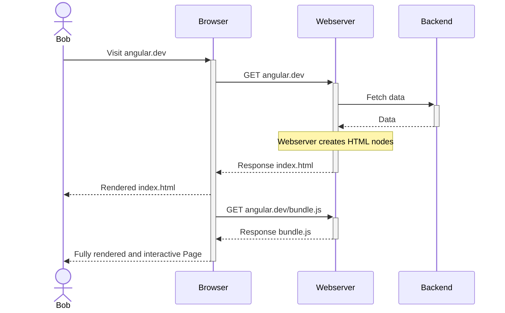
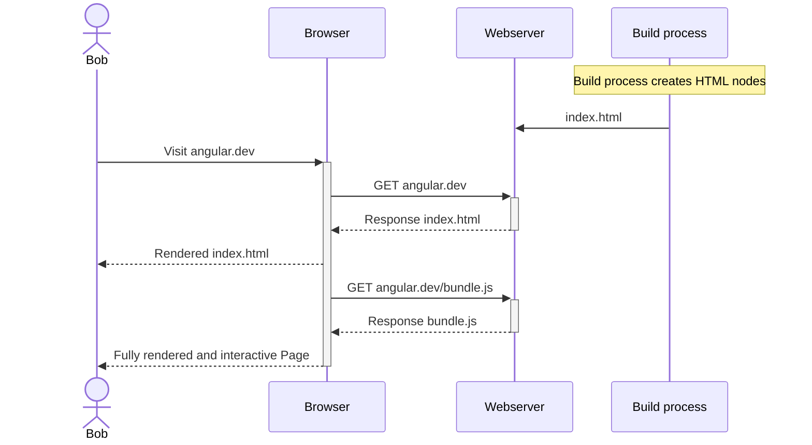

# Angular Performance Optimizations

---
layout: center
---

<div class="px-16">
  
</div>

<!--
SeveltKit, Next.js, 
Lighthouse: Performance, Accessibility, SEO
-->

---
layout: cover
---

# Angular Performance Optimizations

How to elevate the performance of an Angular App to the next level 🚀

<div class="mt-10 h-16 flex flex-row gap-5">
  
</div>

<MySocialLinks />

<!--
The last comment block of each slide will be treated as slide notes. It will be visible and editable in Presenter Mode along with the slide. [Read more in the docs](https://sli.dev/guide/syntax.html#notes)
-->

---

# Content

- Application
- Measurements
- Optimization steps
  - General
  - Standalone components
  - Lazy loading
  - Image loading
  - Built-in Control flow
  - esbuild
  - Server-side rendering
- Results

---

# Angular Music

<div class="px-16">
  
</div>

---

# Measurements

- Lines of code
- Build duration
- Initial bundle size
- Lighthouse performance score
  - First Contentful Paint
  - Largest Contentful Paint
  - Total Blocking Time
  - Cumulative Layout Shift
  - Speed Index

<!--
- First Contentful Paint: Time to first text or image is painted on Screen
- Largest Contentful Paint: Time to the largest text or image is painted
- Total Blocking Time: Total amount of time after First Contentful Paint where the main thread is blocked for long enough (>50ms) to prevent input responsiveness
- Cumulative Layout Shift: Movement of visible page content
- Speed Index: How quickly content is visually displayed during page load
-->

---

# General

- Choose base components wisely (`MatToolbar`, `MatCard`, `MatSidenav`)
- Do not use TailwindCSS `@apply` in CSS files
- Use CSS instead of JavaScript
- Reduce Backend request count and payload
- Cache JavaScript and CSS bundles

<!-- 
Prefer CSS media queries instead of using BreakpointObserver
-->

---

# Standalone components [^1]

- Available since Angular 15

<div class="flex flex-row justify-around">

```ts
@Component({
  selector: 'app-login',
  templateUrl: './login.component.html',
})
export class LoginComponent {}

@NgModule({
  declarations: [LoginComponent],
  imports: [CommonModule, MatButtonModule],
  exports: [LoginComponent]
})
export class LoginModule {}
```

```ts
@Component({
  selector: 'app-login',
  templateUrl: './login.component.html',
  standalone: true,
  imports: [NgIf, MatButtonModule],
})
export class LoginComponent {}
```

</div>

[^1]: https://github.com/sonallux/angular-music/pull/106

<!--
- Some new Angular Feature require standalone components
-->

---

# Standalone components [^1]

| Stats               | Relative change |
|---------------------|-----------------|
| Build time          | + 2%            |
| Lines of code       | - 2%            |
| Initial bundle size | - 2%            |

[^1]: https://github.com/sonallux/angular-music/pull/106

<!--
- Some new Angular Feature require standalone components
-->

---

# Lazy loading [^1]

- Lazy load routes
- Lazy load animations `provideAnimationsAsync()` (>= Angular 17)
- Defer component loading with `@defer` (only works for standalone components) (>= Angular 17)

<div class="mt-4" v-click>

| Stats               | Relative change |
|---------------------|-----------------|
| Build time          | - 5%            |
| Lines of Code       | 0%              |
| Initial bundle size | - 33%           |

</div>

[^1]: https://github.com/sonallux/angular-music/pull/107

---

# Image loading [^1]

- Adjust image size to render size
- Add `preconnect` instructions
- Use `NgOptimizedImage` directive (>= Angular 15)

<div class="mt-4" v-click>

| Stats               | Relative change |
|---------------------|-----------------|
| Build time          | + 2%            |
| Lines of Code       | + 2%            |
| Initial bundle size | + 1%            |

</div>

[^1]: https://github.com/sonallux/angular-music/pull/108

---

# Built-in control flow [^1]

- Available since Angular 17 in developer preview
- Replaces the existing `NgIf`, `NgFor` and `NgSwitch` Directives

[^1]: https://github.com/sonallux/angular-music/pull/162

---

# Built-in control flow - `@if` block

<div class="flex flex-row justify-around">

```html
<h1 *ngIf="isLoggedIn; else loggedOut">
  Hello User!
</h1>
<ng-template #loggedOut>
  Please log in!
</ng-template>
```

```html
@if (isLoggedIn) {
  <h1>Hello User!</h1>
} @else {
  <h1>Please log in!</h1>
}
```

</div>

<!--
- `@else if (condition)` also possible
-->

---

# Built-in control flow - `@for` block

<div class="flex flex-row justify-around">

```html
<ul>
  <li *ngFor="let item of items">{{ item.name }}</li>
  <li *ngIf="items.length === 0">There are no items</li>
</ul>
```

```html
<ul>
  @for (item of items; track item.name) {
    <li>{{ item.name }}</li>
  } @empty {
    <li>There are no items</li>
  }
</ul>
```

</div>

---

# Built-in control flow - `@switch` block

<div class="flex flex-row justify-around">

```html
<ng-container [ngSwitch]="orderStatus">
  <span *ngSwitchCase="'PLACED'">
    Order received, order processing started
  </span>
  <span *ngSwitchCase="'SHIPPED'">
    Order shipped
  </span>
  <span *ngSwitchCase="'DELIVERED'">
    Order delivered! Enjoy your purchase
  </span>
  <span *ngSwitchCase="'CANCELED'">
    Order canceled
  </span>
  <span *ngSwitchDefault>
    Invalid order status: {{orderStatus}}
  </span>
</ng-container>
```

```html
@switch (orderStatus) {
  @case ('PLACED') {
    <span>Order received, order processing started</span>
  }
  @case ('SHIPPED') {
    <span>Order shipped</span>
  }
  @case ('DELIVERED') {
    <span>Order delivered! Enjoy your purchase</span>
  }
  @case ('CANCELED') {
    <span>Order canceled</span>
  }
  @default {
    <span>Invalid order status: {{orderStatus}}</span>
  }
}
```

</div>

---

# Built-in control flow [^1]

<div class="mt-4" >

| Stats               | Relative change |
|---------------------|-----------------|
| Build time          | - 2%            |
| Lines of Code       | + 1%            |
| Initial bundle size | + 6%            |

</div>

[^1]: https://github.com/sonallux/angular-music/pull/162

<!--
- More performance optimized code
- @for is significant faster than *ngFor
-->

---

# esbuild [^1]

- Switch bundler from webpack to esbuild
- Use `browser-esbuild` as drop-in replacement or `application` builder (>= Angular 17)

<div class="mt-4" v-click>

| Stats               | Relative change |
|---------------------|-----------------|
| Build time          | - 46%           |
| Lines of Code       | 0%              |
| Initial bundle size | + 8%            |

</div>

<!--
- webpack (javascript)
- esbuild (Go)
-->

[^1]: https://github.com/sonallux/angular-music/pull/109

---

# Server-side rendering (SSR) [^1]

<!--
- < Angular 17: nguniversal
- >= Angular 17: built into Angular CLI using Application builder
-->

[^1]: https://github.com/sonallux/angular-music/pull/110

---

# Client-side rendering



<!--
Templates are rendered on the Browser
-->

---

# Server-side rendering (SSR)



<!--
Templates are rendered on the Server
-->

---

# Static Side generation (SSG)



<!--
Templates are rendered during the build process of the App. Not tried.
-->

---

# Server-side rendering (SSR) [^1]

| Stats               | Relative change |
|---------------------|-----------------|
| Build time          | + 55%           |
| Lines of Code       | + 3%            |
| Initial bundle size | + 2%            |

[^1]: https://github.com/sonallux/angular-music/pull/110

<!--
- Server bundle must be built too
- Workaround for some APIs that are not available on Server during rendering
- Code for hydration is needed
-->

---

# Lighthouse Score

| Page     | Baseline | Standalone | Lazy loading | Image loading | Control flow | esbuild | SSR |
|----------|----------|------------|--------------|---------------|--------------|---------|-----|
| Home     | 89       | 88         | 87           | 88            | 89           | 89      | 89  |
| Browse   | 61       | 69         | 63           | 82            | 76           | 76      | 75  |
| Category | 87       | 81         | 88           | 87            | 87           | 87      | 79  |
| Playlist | 93       | 93         | 93           | 93            | 93           | 93      | 95  |
| Album    | 93       | 93         | 93           | 93            | 93           | 93      | 98  |
| Artist   | 90       | 91         | 93           | 91            | 92           | 91      | 97  |
|          |          |            |              |               |              |         |     |
| Average  | 86       | 86         | 86           | 89            | 88           | 88      | 89  |

<!--
- Measurement taken on GitHub Actions
- Desktop mode vs mobile mode
- Values are from desktop mode
- More throttling on mobile mode: nearly no improvement in Lighthouse score
- Browse and Category SSR Score: Playlist grid column count is calculated via JS and fixed to 3 cols with SSR &rarr; big cumulative layout shift
-->

---

# Next steps

- OnPush change detection
- Angular signals
- Zoneless change detection

---

# Fragen ?

<ul class="mt-10">
  <li><a href="https://github.com/sonallux/angular-music"><mdi-github /> Angular Music App</a></li>
  <li><a href="https://web.dev/articles/vitals?hl=de#core-web-vitals"><mdi-file-document />Core Web Vitals</a></li>
  <li><a href="https://angular.dev/guide/defer"><mdi-angular /> Deferrable Views</a></li>
  <li><a href="https://angular.dev/guide/image-optimization"><mdi-angular /> NgOptimizedImage</a></li>
  <li><a href="https://angular.dev/guide/ssr"><mdi-angular /> Server-side rendering</a></li>
  <li><a href="https://angular.dev/guide/hydration"><mdi-angular /> Hydration</a></li>
  <li><a href="https://angular.dev/guide/prerendering"><mdi-angular /> Prerendering (SSG)</a></li>
  <li><a href="https://github.com/tastejs/angular-movies"><mdi-github /> Angular Movies App</a></li>
</ul>

<MySocialLinks />
